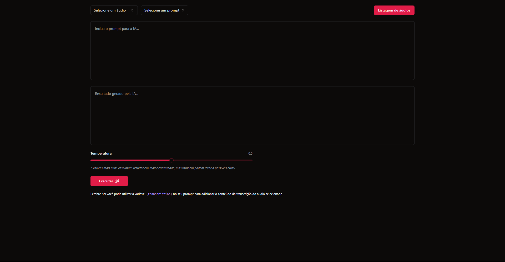
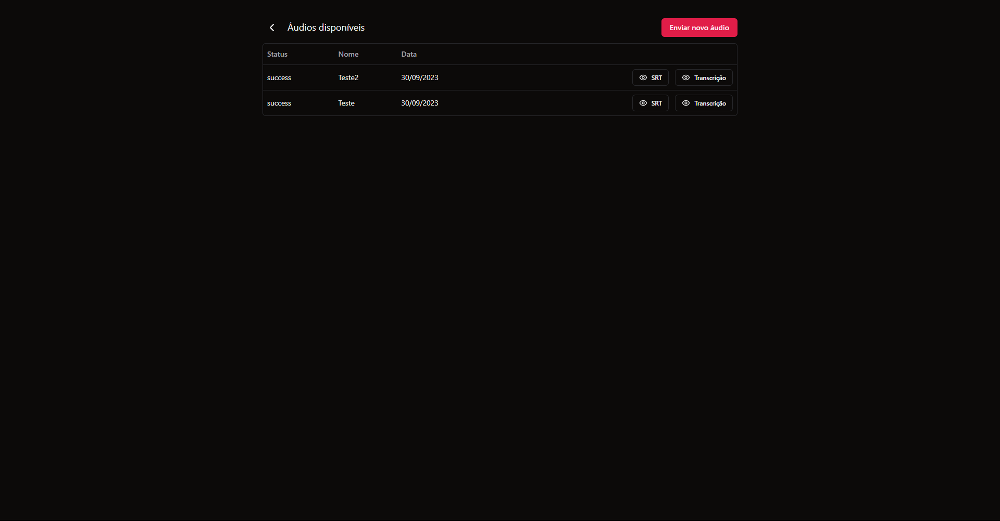
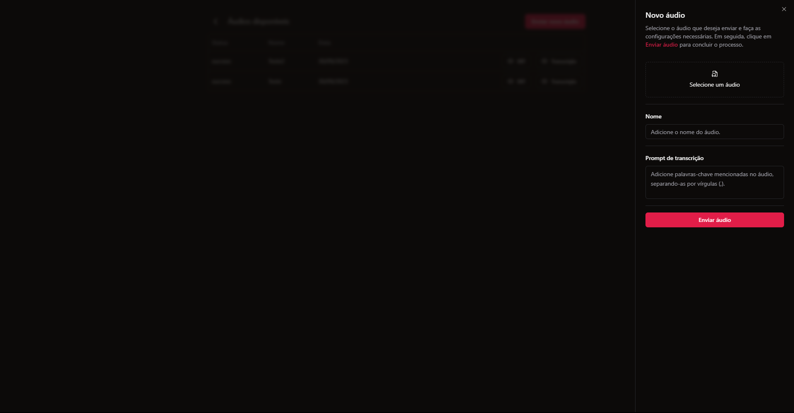

# Transcribe AI
<p align="center">
  
</p>

## Índice
1. [Visão Geral](#visão-geral)
2. [Estrutura de Pastas](#estrutura-de-pastas)
3. [Tecnologias Utilizadas](#tecnologias-utilizadas)
4. [Instalação](#instalação)
5. [Execução](#execução)
6. [Screenshot](#execução)

## Visão Geral
O **Transcribe AI** é uma aplicação projetada para simplificar o processo de transcrição de áudios, fornecendo recursos de geração de legendas (SRT) e transcrições de maneira eficiente e automatizada.

Com a capacidade de interação direta com o ChatGPT, o **Transcribe AI** eleva a geração de conteúdo relacionado a um novo patamar, possibilitando uma abordagem inteligente e aprimorada.

Aprimore a produtividade e agilize suas tarefas de transcrição com essa ferramenta poderosa. Transcrições precisas e automatizadas estão ao seu alcance com o **Transcribe AI**.

## Estrutura de Pastas
O projeto está organizado em uma estrutura de pastas que segue boas práticas de arquitetura de software. Algumas pastas principais incluem:

- `src/components`: Componentes reutilizáveis.

- `src/lib`: Páginas da aplicação.

- `src/pages`: Páginas da aplicação.

- `src/services`: Lógica de negócios e serviços.

- `src/styles`: Estilos globais e utilitários.

## Tecnologias Utilizadas
- **React/Vite/TypeScript**: O frontend é construído com React, Vite para a configuração do projeto e TypeScript para uma codificação mais segura e produtiva.

- **Zod**: Utilizamos Zod para validação de dados, garantindo que as informações fornecidas à aplicação sejam consistentes e corretas.

- **Tailwind CSS**: O Tailwind CSS é um framework de estilos utilitários que facilita a criação de interfaces modernas e responsivas.

- **React Query**: Esta biblioteca é utilizada para o gerenciamento de estado e cache de dados na aplicação React.

- **Shadcn**: Componentes react.

## Instalação
Siga os passos abaixo para instalar as dependências do projeto:

```bash
# Clone o repositório
git clone https://github.com/lucas-eduardo/transcribe-ai-web.git

# Acesse o diretório do projeto
cd transcribe-ai-web

# Instale as dependências
yarn install
```

## Execução
Para executar a aplicação, siga os passos abaixo:

```bash
yarn dev
```

## Screenshot
<p align="center">
  
  
  
</p>

[Repositório da API](https://github.com/lucas-eduardo/transcribe-ai-api)